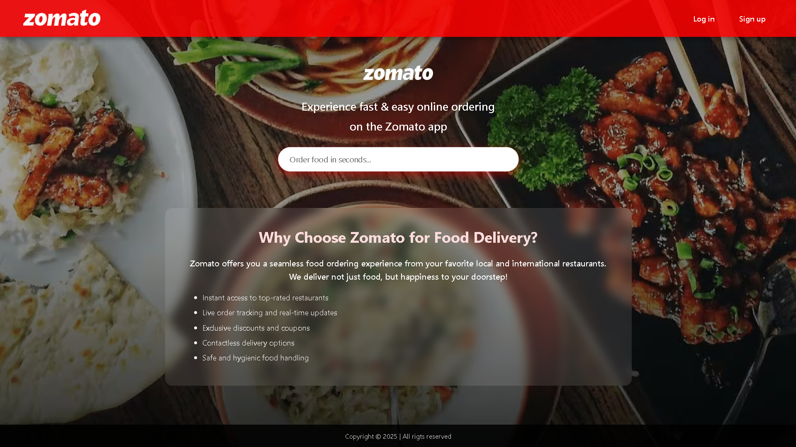

# 🍽 Zomato Homepage Clone

This is a basic clone of Zomato’s homepage created using *HTML* by me and *CSS + JavaScript* with AI assistance.

## 📁 Project Structure
- index.html – Main HTML file
- css/ – Contains the styling file (Demo.css)
- images/ – Contains logo and background images
- js/ – Contains the JavaScript file (script.js)

## 🚀 Features
- Zomato-style homepage layout
- Responsive design (basic)
- Simple navigation links (Log In / Sign Up)
- Search bar for restaurant/cuisine
- Informative sections about food delivery

## 🎯 Purpose
The goal of this project was to practice frontend web development by:
- Writing HTML code independently
- Learning to use AI tools for CSS and JS assistance
- Hosting a simple web page on GitHub

## 🌐 Live Demo
[Click here to view live (if hosted)](https://github.com/shahid786-dot/Zomato-homepage)

---

### 📸 Screenshot
Here's how the homepage looks:

---

### 🛠 Tech Stack
- HTML
- CSS
- JavaScript

## ✍ Author
*Shahid Ulla*  
[GitHub](https://github.com/shahid786-dot)